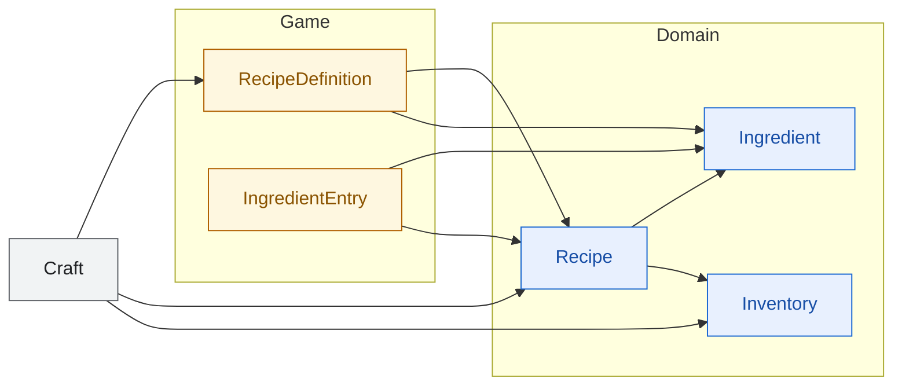

<!-- 現状確認用。手で維持する。
     構造が変わったら tools/diagram-diff.ps1 の出力（docs/dependencies-diff-diagrams/）
     を見て、この図を更新すること。更新漏れは SliceDiagramTests が検出する。
     枠の色: 青 = Domain / 橙 = Game / 灰 = Legacy（境界として置いているだけ） -->

# クラフト 🔨

レシピの定義と、素材が足りているかの判定。

`RecipeDefinition` は ScriptableObject。`ToDomain()` で `Recipe` に変換する。
`Recipe.CanCraftWith` が `Inventory` を読むので、持ち物のスライスと接する。
