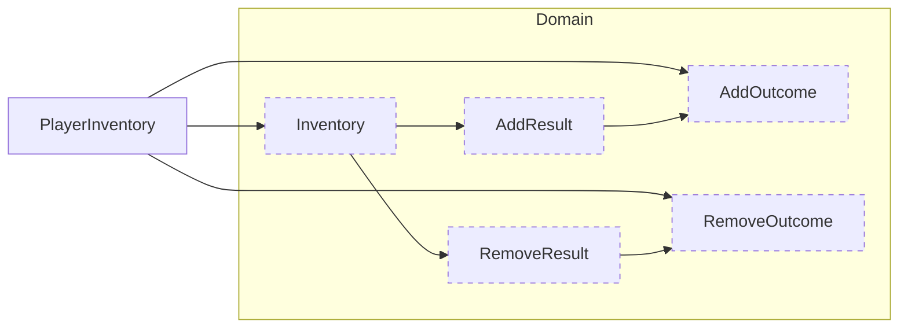

<!-- 現状確認用。手で維持する。
     構造が変わったら tools/diagram-diff.ps1 の出力（docs/dependencies-diff-diagrams/）
     を見て、この図を更新すること。更新漏れは SliceDiagramTests が検出する。
     枠: 破線 = Domain / 太線 = Game / 細線 = Legacy（境界として置いているだけ） -->

# 持ち物 🎒

所持品の追加・削除。スロットと重ねの規則を持つ。

`PlayerInventory` は Legacy。効果の適用と UI を持ったまま、
判定だけを `Inventory` に委譲している。
