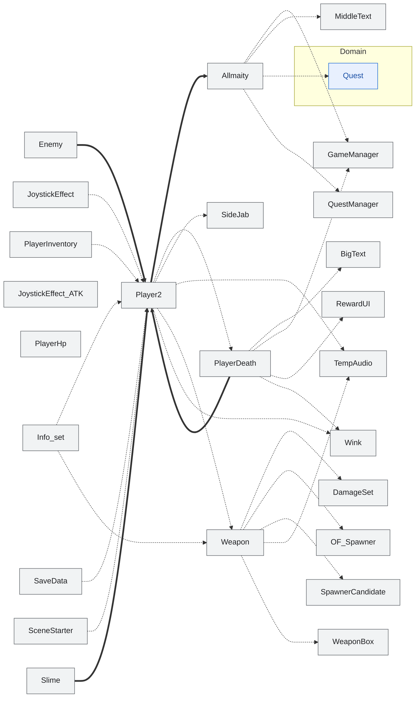

<!-- 自動生成。図を手で直さない。dotnet test が作り直す。
     切り方と見出しは docs/dependencies-diagrams/slices.txt にある。
     末尾の覚え書きの節だけが手書きで、作り直しても消えない。
     枠の色: 青 = Domain / 橙 = Game / 灰 = Legacy（境界として置いているだけ）
     メンバは Domain / Game の核の公開分だけ。Legacy の中身は載せない。
     線: 太線 = 属性として保持する関係 / 点線 = 本体の中で使うだけの関係 -->

# プレイヤー 🚶

操作、体力、攻撃、死亡。

## 覚え書き

（まだ無い）
