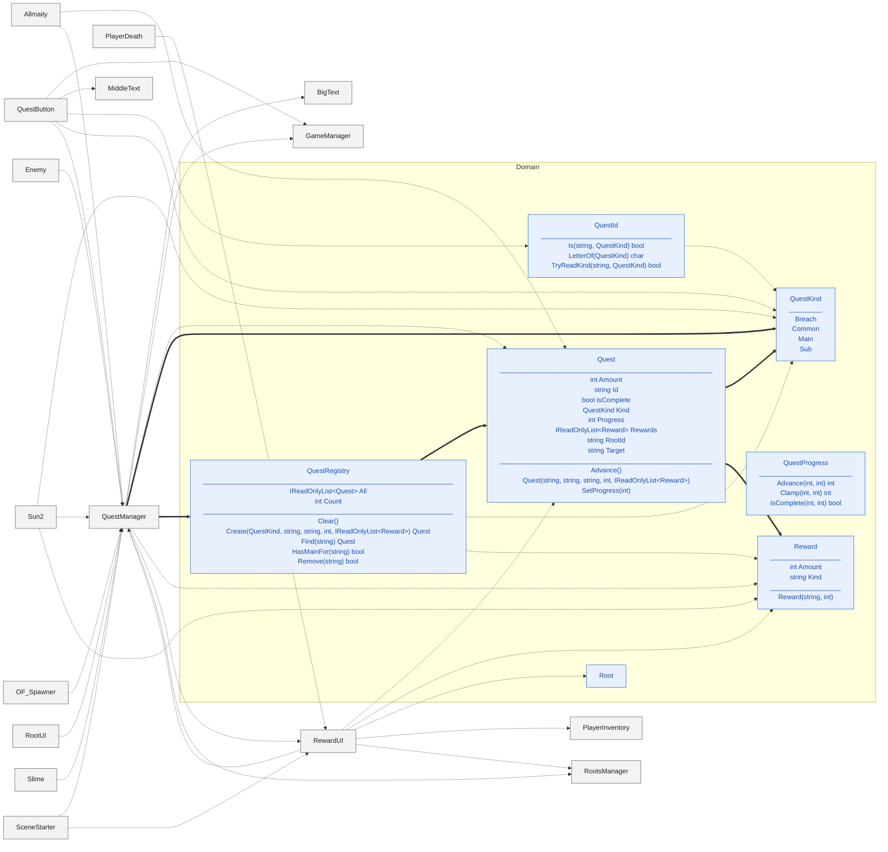

<!-- 自動生成。図を手で直さない。dotnet test が作り直す。
     見出しと一行説明は .claude/skills/class-diff-diagram/SKILL.md のスライス表にある。
     末尾の覚え書きの節だけが手書きで、作り直しても消えない。
     枠の色: 青 = Domain / 橙 = Game / 灰 = Legacy（境界として置いているだけ）
     メンバは Domain / Game の核の公開分だけ。Legacy の中身は載せない。
     線: 太線 = 属性として保持する関係 / 点線 = 本体の中で使うだけの関係 -->

# クエスト 📜

依頼の受注と達成判定、報酬の受け渡し。

## 覚え書き

（まだ無い）
