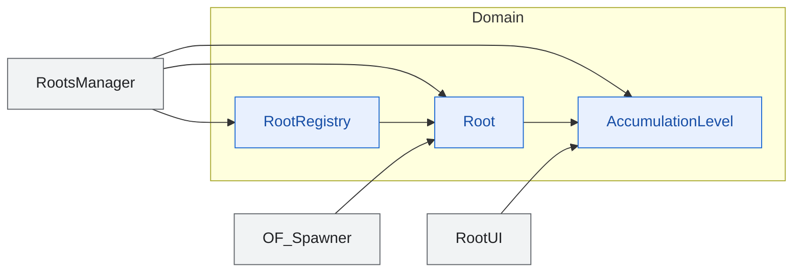

<!-- 現状確認用。手で維持する。
     構造が変わったら tools/diagram-diff.ps1 の出力（docs/dependencies-diff-diagrams/）
     を見て、この図を更新すること。更新漏れは SliceDiagramTests が検出する。
     枠の色: 青 = Domain / 橙 = Game / 灰 = Legacy（境界として置いているだけ） -->

# 根源 🌳

根源の素性と、攻略度・危険度・蓄積値の規則。

`RootRegistry` が追加・検索・日次更新の唯一の窓口。`TryAdd` が Id の重複を
拒否するので、シーン再入場で根源が増えない。

日次の変化は2段階に分かれている。蓄積値の増加のあと氾濫を判定し、
そのあとで攻略度が減る。順序を変えると氾濫時のスポーンが読む攻略度が変わる。
