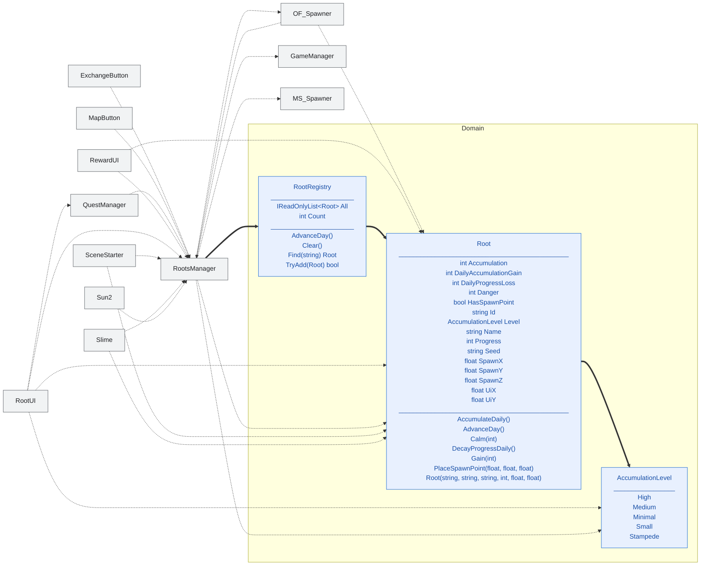

<!-- 自動生成。図を手で直さない。dotnet test が作り直す。
     見出しと一行説明は .claude/skills/class-diff-diagram/SKILL.md のスライス表にある。
     末尾の覚え書きの節だけが手書きで、作り直しても消えない。
     枠の色: 青 = Domain / 橙 = Game / 灰 = Legacy（境界として置いているだけ）
     メンバは Domain / Game の核の公開分だけ。Legacy の中身は載せない。
     線: 太線 = 属性として保持する関係 / 点線 = 本体の中で使うだけの関係 -->

# 根源 🌳

根源の素性と、攻略度・危険度・蓄積値の規則。

## 覚え書き

`RootRegistry` が追加・検索・日次更新の唯一の窓口。`TryAdd` が Id の重複を
拒否するので、シーン再入場で根源が増えない。

日次の変化は2段階に分かれている。蓄積値の増加のあと氾濫を判定し、
そのあとで攻略度が減る。順序を変えると氾濫時のスポーンが読む攻略度が変わる。
