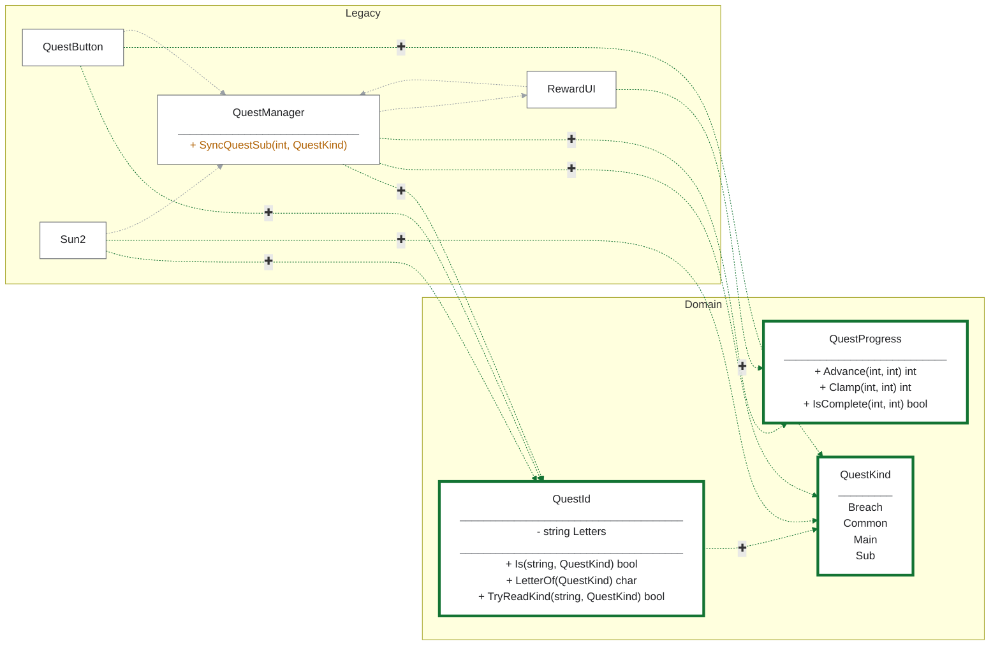

<!-- tools/diagram-diff.ps1 が生成する。手で編集しない -->

# 依存の差分  HEAD -> 作業ツリー  (2026-08-29)

型 +3 / -0　　辺 +9 / -0 / 種類変化 0　　メンバが動いた型 1

**色が変化** — 緑が追加、赤が削除、橙が関連と依存の入れ替わり、灰が変わっていない
**線種が関係** — 太線が関連（フィールドで保持）、点線が依存（signature に出るだけ）
緑の枠が現れた型、赤の枠が消えた型。塗りは白で統一。
メンバは文字色で示す。緑が追加、赤が削除、橙が変更。

この図を見て `docs/dependencies-diagrams/` の現状図を更新すること。
