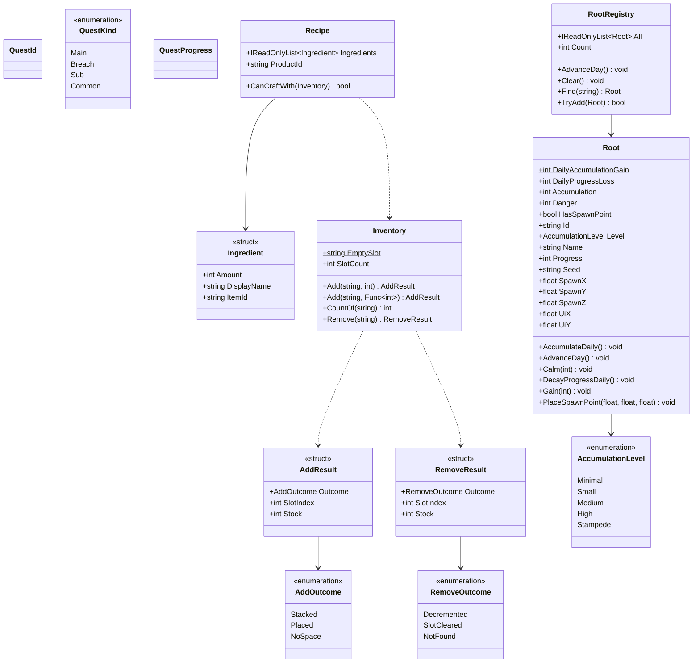

<!-- このファイルは DomainDiagramTests が生成する。手で編集しない -->

# Domain 層のクラス図

```mermaid
classDiagram
    class AccumulationLevel {
        <<enumeration>>
        Minimal
        Small
        Medium
        High
        Stampede
    }
    class AddOutcome {
        <<enumeration>>
        Stacked
        Placed
        NoSpace
    }
    class AddResult {
        <<struct>>
        +AddOutcome Outcome
        +int SlotIndex
        +int Stock
    }
    class Ingredient {
        <<struct>>
        +int Amount
        +string DisplayName
        +string ItemId
    }
    class Inventory {
        +string EmptySlot$
        +int SlotCount
        +Add(string, int) AddResult
        +Add(string, Func~int~) AddResult
        +CountOf(string) int
        +Remove(string) RemoveResult
    }
    class QuestId {
    }
    class QuestKind {
        <<enumeration>>
        Main
        Breach
        Sub
        Common
    }
    class QuestProgress {
    }
    class Recipe {
        +IReadOnlyList~Ingredient~ Ingredients
        +string ProductId
        +CanCraftWith(Inventory) bool
    }
    class RemoveOutcome {
        <<enumeration>>
        Decremented
        SlotCleared
        NotFound
    }
    class RemoveResult {
        <<struct>>
        +RemoveOutcome Outcome
        +int SlotIndex
        +int Stock
    }
    class Root {
        +int DailyAccumulationGain$
        +int DailyProgressLoss$
        +int Accumulation
        +int Danger
        +bool HasSpawnPoint
        +string Id
        +AccumulationLevel Level
        +string Name
        +int Progress
        +string Seed
        +float SpawnX
        +float SpawnY
        +float SpawnZ
        +float UiX
        +float UiY
        +AccumulateDaily() void
        +AdvanceDay() void
        +Calm(int) void
        +DecayProgressDaily() void
        +Gain(int) void
        +PlaceSpawnPoint(float, float, float) void
    }
    class RootRegistry {
        +IReadOnlyList~Root~ All
        +int Count
        +AdvanceDay() void
        +Clear() void
        +Find(string) Root
        +TryAdd(Root) bool
    }
    AddResult --> AddOutcome
    Inventory ..> AddResult
    Inventory ..> RemoveResult
    Recipe --> Ingredient
    Recipe ..> Inventory
    RemoveResult --> RemoveOutcome
    Root --> AccumulationLevel
    RootRegistry --> Root
```
